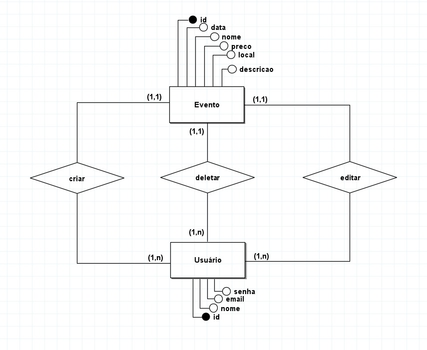

# back-end-tf-web
Back-End do trabalho final da disciplina de WEB

Grupo
Farley
Davi
Eliarito
Vinicius
Hugo
Luiz Eduardo

Usuário
Altera dados de um determinado usuário
Endpoint:https://glowing-eureka-ggpxpv45464c5vp-3000.app.github.dev/usuario/
Tipo da requesição:Put
Body:
{
  "id": 1,
  "nome": "Nome do usuário",
  "senha": "***",
  "email": "email_usuario@email.com"
}

Usuário
Deleta um determinado usuário do banco de dados
Endpoint: https://glowing-eureka-ggpxpv45464c5vp-3000.app.github.dev/usuario/s
Tipo da requisição: Delete 
Body: 

Usuário
Envia dados de um usuário pra um determinado servidor 
Endpoint: https://glowing-eureka-ggpxpv45464c5vp-3000.app.github.dev/usuario/1/
Tipo da requisição: Post 
Body: 

Usuário
Obtém/consulta o usuário ou os usuários do banco de dados
Endpoint: https://glowing-eureka-ggpxpv45464c5vp-3000.app.github.dev/usuarios
Tipo da requisição: Get
Body: 

Usuário
Insere uma nova linha (um novo usuário) no banco de dados
Endpoint: https://glowing-eureka-ggpxpv45464c5vp-3000.app.github.dev/usuario/
Tipo da requisição: post
Body:
{
  "nome": "Nome do usuário",
  "senha": "***",
  "email": "email_usuario@email.com"
}

Evento
Colocar um cliente novo e cadastra-lo no evento 
Endpoint:https://glowing-eureka-ggpxpv45464c5vp-3000.app.github.dev/evento/1
Tipo da requisição: Post
Body: 
{
  "id":"11",
  "nome":"cabaré Hoje",
  "preco":"50",
  "data":"11/1/2024",
  "decricao":"Seja  mminha farofa para passar a linguica",
  "fk_usuario_id":"1"
}
Evento
Consultar/pegar o cliente que está cadastrado no evento
Endpoint: https://glowing-eureka-ggpxpv45464c5vp-3000.app.github.dev/evento
Tipo da requisição: Get
Body:

Link do modelo Conceitual
()

Link do modelo Lógico
(.jpg>))

Link do modelo Físico
([Modelo Físico](db/DDL.sql))

FERRAMENTAS USADAS: BrMODELO E NEON TECH